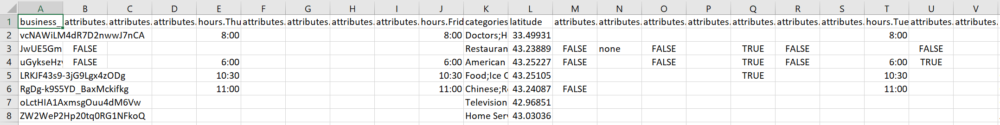
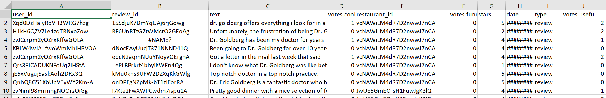

# SOEN-691-PROJECT BIG DATA ANALYTICS PROJECT

## Team Composition

| Name  | Student id | Email Ids |
| --- | --- | ---|
| 40087977 | Sai Krishna | saich94@gmail.com |
| 40083289 | Dhaval Modi | dhavalmodi556@gmail.com |
| 40082236 | Manushree Mallaraju | NA |

## Project Type
Dataset Analysis (Recommender System)

## Abstract
In the given dataset we have more than 40k restaurants scattered across different metro cities. It is obviously difficult to find the best restaurant in the city. So for a user, who is new to the city, we want to build a recommender system which can give him/her options of various restaurants based on the different parameters. The parameters that we are going to consider are reviews given by others, similar restaurant to his/her personal preference and location. We will implement two recommender systems, which will be content based and colloberative filtering based.

## I. Introduction
### Context

There are many options available to a particular user. But it would be more helpful, if we could get personalized preferences. This user might review the restaurant. And adding his/her rating, we can improvise the recommedation for the next user. So, with each increased rating we can make our recommender system more efficient with increasing amount of data. That is exactly our goal, to make best use of the avalable dataset and to make the best matching restaurant to user's need.

### Objectives

* The main objective of this project is to recommend a restaurant to a user, based on ratings and number of votes using two most popular algorithms.
* The second objective is to evaluate the result obtained using Root mean squared error (RMSE) metric. And then comparing the evaluation results of these algorithms.

### Presentation of the problem to solve

* <b>Problem : </b> To find a recommedation of a restaurant based on the reviews/preference and location.

  <b>Solution: </b> First we will analyse the exisitng data, transform the data. And then we will recommend the restaurant to users based on Content Based recommnedation and ALS recommender. At the end, we will also compare the result of these two recommnder algorithms.

* <b>Problem : </b> Out of these two algorithms, which algorithm performs better.
 
  <b>Solution: </b> We will evaluate the each algorithms results using RMSE metric. Then we can compare these results to find out the best performing algorithm.

### Related work 

There are many data analysis papers on this datataset.  
* https://www.kaggle.com/parthsharma5795/finding-the-best-restaurants-in-bangalore  
* https://www.kaggle.com/chirag9073/zomato-restaurants-analysis-and-prediction  

These two studies can be taken into consideration into initial stages of data preparation. For ex. Data Loading and Cleaning. However, these work are limited to analysis of the data. We want to go one step further and want to implement ALS and Content based recommender system for the user base.

## II. Materials and Methods

### Dataset

This dataset is not officially provided by the Data Owner. It is collected using the APIs. It is publicly available and uploaded by the user who has colllected and updated the data over the period of time. 

The dataset consists of two csv files. One csv file containes all the different restaurant and it's attributes. There are more than 40k restaurants. The other file contains the review provided by different user to different restaurants. 

* <b>Restaurant.csv </b> : This dataset contains 42K unique along with different attribues of each restaurants. We are interrested in below given columns.
  * <b>restaurant_id :</b> unique Id for restaurant  
    * We have chosen this column to uniquly identify restaurant.
  * <b>city :</b> where restaurant resides.  
    * We have chosen this column to filter based on city.
  * <b>categories :</b> under which category restaurant resides.  
    * We have chosen this column to generate the user profile.
  * <b>total_reviews :</b> number of votes given to particular restaurant  
    * We have chosen this column to put thresold for minimum number of votes. If the restaurant have total     reviews less than five. we have filtered them out. 

* <b>Reviews.csv : </b> This dataset contains more than 1400k rows where each row represents the review and rating given by the user. The rating scale is [1, 5]. We are interrested in below given columns.
  * <b>user_id :</b> unique Id for user.  
    * We have chosen this column to uniquly identify users.
  * <b>user_rating :</b> rating given by a user to the restaurant.  
    * We have chosen this column if the user want to filter based on city.

Though it's unofficial dataset, the datset uniform but definitely not ideal. In other words, there are many attributes which definitely not going to help in calculating recommandation. So before that we need to transform the data into desired dataset.

The main columns we have considered are given below.

* <b>user_id :</b> unique Id for user profile  
&nbsp;   &nbsp;   &nbsp; We have chosen this column to uniquly identify users.

* <b>user_rating :</b> average rating of the restaurant  
&nbsp;   &nbsp;   &nbsp; We have chosen this column to use these rating for content based filtering.

### Sample Data

* <b>Restaurants </b>

* <b>Reviews </b>

### Technologies

We are going to use Python, Pandas, Spark and Matplotlib. We are going to use Python libraries for general computation on data. Pandas & Spark will be useful analysing data and also transforming the data at the same time. Using Matplotlib, we will be able to generate graphs for visulization of huge data.

### Algorithms

* <b>Content-based filtering :</b> In this algorithm, we will use item metadata, such as Locality, Cuisine, rating, etc. for restaurants, to make these recommendations. Here, we are solely relied on item data rather than other user's  metadata.

* <b>Alternating Least Squares (ALS) :</b>  Using this algorithm, we will try to predict the rating or preference that a user would give an item-based on past ratings and preferences of other users. In this technique, we will not use item metadata unlike content-based filtering algorithm.

### Metrics

* <b>Root Mean Squared Error (RMSE) :</b> RMSE is a quadratic scoring rule that also measures the average magnitude of the error. It’s the square root of the average of squared differences between prediction and actual observation.
* <b>Mean Absolute Error (MAE) :</b> MAE measures the average magnitude of the errors in a set of predictions, without considering their direction. It’s the average over the test sample of the absolute differences between prediction and actual observation where all individual differences have equal weight.
* <b>Mean Squared Error (MSE) :</b> MSE measures average squared error of our predictions. For each point, it calculates square difference between the predictions and the target and then average those values.

### References

* Recommender Systems: The Textbook, Springer, April 2016 http://www.charuaggarwal.net/Recommender-Systems.htm
* A Preference-Based Restaurant Recommendation System for Individuals and Groups https://www.cs.cornell.edu/~rahmtin/Files/YelpClassProject.pdf
* U. Farooque, B. Khan, A. B. Junaid and A. Gupta, "Collaborative Filtering based simple restaurant recommender," 2014 International Conference on Computing for Sustainable Global Development (INDIACom), New Delhi, 2014, pp. 495-499.

