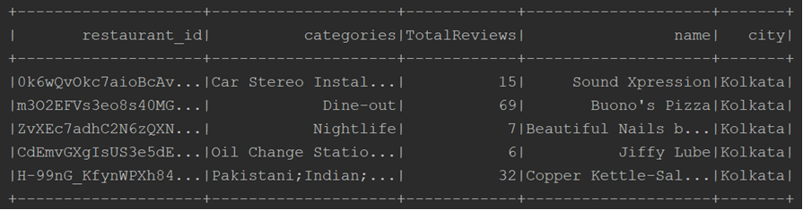

# SOEN-691-PROJECT BIG DATA ANALYTICS PROJECT

## Team Composition

| Name  | Student id | Email Ids |
| --- | --- | ---|
| 40087977 | Sai Krishna | saich94@gmail.com |
| 40083289 | Dhaval Modi | dhavalmodi556@gmail.com |
| 40082236 | Manushree Mallaraju | manushreemallaraju@gmail.com |

## Project Type
Dataset Analysis (Recommender System)

## Abstract
In the given dataset we have more than 40k restaurants scattered across different metro cities. Our goal is to build the recommender system as recommender Engines or Systems are among the most popular applications of data science today.These systems  are used to predict the “rating” or “preference” that a user would give to an item. We will implement two recommender systems, which will be content based and colloberative filtering based using algorithms ALS and TF-IDF in Apache Spark. We will evaluate the results based on RMSE and other metrics and recommend restaurants to the user.

## I. Introduction
### Context

The restaurant recommendation system is a very popular service whose sophistication keeps increasing every day. The objective of a Recommender System is to generate meaningful recommendations to a collection of users for items or products that might interest them. There are many recommendation systems available for problems like shopping, online video entertainment, games, etc. Restaurants & Dining is one area where there is a big opportunity to recommend dining options to users based on their preferences as well as
historical data. Zomato is a very good source of such data with not only restaurant reviews, but also user-level information on their preferred restaurants.


### Objectives

The main goal of the project is to build collaborative and content-based recommender systems based on the user ratings. These are the two main recommender systems discussed in class. Collaborative filtering approaches building a model from a user's past behavior whereas Content-based filtering approaches utilize a series of discrete characteristics of an item in order to recommend additional items with similar properties.

### Presentation of the problem to solve

* <b>Problem: </b> Build a recommendation system based on user reviews and choices.

  <b>Solution: </b>First we will analyze the existing data, transform the data. And then we will recommend the restaurant to users based on Content-Based and Collaborative systems

* <b>Problem : </b> Out of these two algorithms, which algorithm performs better.
 
  <b>Solution: </b> We will evaluate the results of each algorithm using metrics like RMSE, MAE & MSE. Then we can compare these results to find out the best performing algorithm.

### Related work 

There are many data analysis papers on this datataset. <br />
* https://arxiv.org/pdf/1903.10117.pdf<br />
* https://www.kaggle.com/parthsharma5795/finding-the-best-restaurants-in-bangalore <br />
* https://www.kaggle.com/chirag9073/zomato-restaurants-analysis-and-prediction <br />

These studies are done using algorithms such as Naive Bayes, K-NN algorithms and metrics like RMSE, MAE is used to evaluate the result and some studies are at analyzing the data. We will build the recommender system using collaborative, Content-based approaches for the user base and analyze the results.

## II. Materials and Methods

### Dataset

The Zomato API provides exhaustive information about each food joint by different filters like location, cuisine, etc. The data is collected using the API. The dataset consists of two CSV files. One CSV file contains all the different restaurants and their attributes. There are more than 40k restaurants. The other file contains the review provided by different users to different restaurants. The rating scale is [1, 5]. It has more than 1000k rows where each row represents the review and rating given by the user. Looking at the number of restaurants and reviews, we think it is enough to be considered for big data.

* <b>Restaurant.csv </b> : This dataset contains 42K unique restaurants along with different attribues of each restaurants. We are interrested in below given columns.
  * <b>restaurant_id :</b> unique id for restaurant <br />
    * We have chosen this column to uniquly identify restaurant.
  * <b>city :</b> where restaurant resides. <br />
    * We have chosen this column to filter based on city.
  * <b>categories :</b> under which category restaurant resides. <br />
    * We have chosen this column to generate the item profile.
  * <b>total_reviews :</b> number of votes given to particular restaurant <br />
    * We have chosen this column to put thresold for minimum number of votes. If the restaurant have total     reviews less than five. we have filtered them out. 

* <b>Reviews.csv : </b> This dataset contains more than 1400k rows where each row represents the review and rating given by the user. The rating scale is [1, 5]. We are interrested in below given columns.
  * <b>user_id :</b> unique Id for user. <br />
    * We have chosen this column to uniquly identify users.
  * <b>user_rating :</b> rating given by a user to the restaurant. <br />
    * We have chosen this column if the user want to filter based on city.


### Sample Data

* <b>Restaurants </b>




* <b>Reviews </b>


### Technologies

* <b>Apache Spark: </b>Apache Spark is a unified analytics engine for big data processing. We will use Dataframe API and  Resilient Distributed Dataset (RDD) for data preprocessing and building data frames.
* <b>Pandas: </b>We will use Pandas for data manipulation, analysis, sorting, handling missing values, cleaning, and visualization.
* <b>Matplotlib: </b> We will use it to generate graphs and for visualization of huge data.
* <b>PySpark ML: </b> It is  DataFrame-based machine learning APIs to let users quickly assemble and configure practical machine learning pipelines.
* <b>Programming language: </b> Python


### Algorithms

* <b>Content-based filtering :</b> We have implemented the below-given algorithm for Content-based filtering. In this algorithm, we will use item metadata, such as Locality, Category, Rating, etc. for restaurants, to make these recommendations. Here, we have solely relied on item data rather than other user's metadata.

  * <b> TF * IDF algorithm : </b> TF \* IDF is an information retrieval technique that weighs a category’s frequency (TF) and its inverse frequency (IDF). The product of the TF and IDF scores of a category is called the TF \* IDF weight of that restaurant category. The TF-IDF score of the category is calculated using below given formulas.
  
       <p align="center"></p>

       <p align="center"></p>
 
   * <b> Prediction : </b> First, we have calculated the cosine similarity between the User vector and Restaurant vector. After finding the cosine similarity we have used below given formula to calculate the user prediction.
      <p align="center"></p>
      
      Where r is a user vector and r' is restaurant vector. Using the above mentioned formula we can find the theta, which implies the distance in terms of angle. Lesser the theta, more the similarity. We can calucate the distance using 180 - theta. The two vectors that we wish to calculate the distance; r_i and r'_i are components of vector r and r' respectively; and i is the number of components we have.

      <p align="center"></p>
      
      Using this formula, we are calculating the predicted value. In the formula x is the cosine similarity as calculated in the previous formula. Here, x_max and x_min represents the thresold values of user values which is 1 or -1. And r_max and r_min represents the thresold values of rating. Rating scale is [1, 5].

* <b>Collaborative filtering :</b> Unlike content-based filtering, this systems doesn’t require description of the data hence it recommends without knowing anything about the products.

  * <b>Alternating Least Squares (ALS) :</b>  Apache Spark ML implements alternating least squares (ALS) for collaborative filtering, a very popular algorithm for making recommendations. ALS recommender is a matrix factorization algorithm that uses Alternating Least Squares with Weighted-Lamda-Regularization (ALS-WR). It factors the user to item matrix A into the user-to-feature matrix U and the item-to-feature matrix M: It runs the ALS algorithm in a parallel fashion.  

      ALS is an iterative optimization process where we for every iteration try to arrive closer and closer to a factorized representation of our original data. if we fix the set of variables X and treat them as constants, then the objective is a convex function of Y and vice versa. Our approach will 1, therefore, be to fix Y and optimize X, then fix X and optimize Y, and repeat until convergence. This approach is known as ALS(Alternating Least Squares). For our objective function, the alternating least squares algorithm is as follows:  

    * <b> Algorithm : </b> Algorithm of ALS

      <p align="center"></p>


## III. Results


### Dataset analysis
* <b>Data Collection: </b>Zomato has built a highly coherent and focused experience that puts the emphasis on being a comprehensive network for food-lovers. Very little on the site is superfluous. We have used the  API to collect the data.

* <b>Data Handling:  </b>The data comprised of all possible features listed on Zomato like "Dine-in or Takeaway", etc. But then we switched to Kolkata as our sample city. We have removed the restaurants with null restaurant_id,user_id and filtered out restaurants based on category and city. In collaborative filtering, we have joined the restaurant and review files based on the restaurant ID.

*  <b>Data Merging:  </b>Data after joining restaurants and review files.

  <p align="center"></p>
  <p align="center"></p>

      
### Technology Implementation
* <b>Content-based filtering :</b>
  * <b>Steps in Content-based filtering:  </b>
    - Loading and preprocessing of restaurants.csv and reviews.csv file's data.
    - Creating a TF-IDF Vectorizer for different categories using the formulas given above.
    - Normalizing the resturant data.
    - Split data into train and test.
    - Generating the user profile based on his/her past rating given to the restaurants. We have used 3 as the thresold value. If the past rating is below 3, we have consider that user doesn't like the restaurant otherwise he/she likes the restaurant. 
    - Generating cosine similarity between user and restaurant vectors to find the distance between vectors. Then calculate the prections using above given formula.
    - Calculate rmse, mea and mse
    - Model outputs top N restaurant recommendations for that user based on the ranking of restaurant rating predictions

* <b>Collaborative filtering :</b> We have used ALS with bias and the forumla for it is 
  user_item interaction+user_mean+item_mean global rating
  * <b>Steps in ALS:  </b>
    - User restaurant review data is collected, Parse the data into the input format for the ALS algorithm and built user-restaurant           interaction model  
    - Split data into train and test
    - ALS model selection and evaluation a user product matrix model.
    - Calculate rmse, mea and mse
    - Model outputs top N restaurant recommendations for that user based on the ranking of restaurant rating predictions

  * <b>ALS Hyperparams:  </b> These are the optimized values
    - maxIter: (10) - the maximum number of iterations to run .
    - rank: (70) - the number of latent factors in the model.
    - regParam: (0.02) the regularization parameter in ALS .
    - Traing to Test ratio: 70:30
    
  The hyperparameters are chosen based on tuning of the values to get the desired rmse
  ```ruby
  als = ALS (maxIter=10, regParam=0.02, rank=70, userCol="userId", itemCol="restId", ratingCol="rating",
               coldStartStrategy="drop", seed=seed)
  ```
  <p align="center"></p>
  
### Technology Comparison

  Restaurants generated in Collabarative and content based filtering
  
  <b>Collaborative filtering </b>
    <p align="center"></p>
  <b>Content-based </b>
    <p align="center"></p>
  <b>Distribution of restaurants by category </b>
    <p align="center"></p>


### Metrics Results

* <b>Root Mean Squared Error (RMSE) :</b> RMSE is a quadratic scoring rule that also measures the average magnitude of the error. It’s the square root of the average of squared differences between prediction and actual observation.
* <b>Mean Absolute Error (MAE) :</b> MAE measures the average magnitude of the errors in a set of predictions, without considering their direction. It’s the average over the test sample of the absolute differences between prediction and actual observation where all individual differences have equal weight.
* <b>Mean Squared Error (MSE) :</b> MSE measures average squared error of our predictions. For each point, it calculates square difference between the predictions and the target and then average those values.

    | Metric | Content Based Filtering | Collaborative Metric |
    | :---: | --- | ---|
    | RMSE | 1.406242291057611 | 1.2542102156106667 |
    | MAE | 1.174760279634468 | 0.9522392380468712 |
    | MSE | 1.9775173811589584 | 1.5730432649421549 |
    | Runtime | 930000 ms | 768000 ms |


## IV. Discussion 
### Conclusion
  - The RMSE, MEA, and MSE of content-based is higher than the collaborative. The ALS based filtering technique better predicts the rating.
  - Restaurant ratings are diverse in content-based recommender.
  - Content-based recommended restaurants that have high review count whereas collaborative recommendations tend to have higher ratings and lower review count.
  - Collaborative Filtering algorithm has the limitations of the Cold-start problem where a recommender does not have adequate information about a user or an item to make relevant predictions. Data Sparsity Is the problem that occurs as a result of a lack of information.

### Limitations

* As API gives the large data around 400 GB, it is difficult to extract and process.
* There are limited hardware resources to process and filter large data.

### Future Work

* Going ahead, we can build Hybrid recommender systems. The best approach would be to use a combination of different approaches. A mix of collaborative and content-based filtering. Some of it will depend on the preferences of the users and some on item features.
* We can implement recommender systems with various algorithms such as SVD++, Bayesian Personalized Ranking (BPR) and deep learning algorithms.

## V. References

* Content-Based Recommendation System. Description and implementation with Python. https://medium.com/towards-artificial-intelligence/content-based-recommender-system-4db1b3de03e7
* Recommendation System, collaborative recommender systems & content-based recommender systems,  http://snap.stanford.edu/class/cs246-2012/slides/07-recsys1.pdf
* A Preference-Based Restaurant Recommendation System for Individuals and Groups https://www.cs.cornell.edu/~rahmtin/Files/YelpClassProject.pdf
* U. Farooque, B. Khan, A. B. Junaid and A. Gupta, "Collaborative Filtering based simple restaurant recommender," 2014 International Conference on Computing for Sustainable Global Development (INDIACom), New Delhi, 2014, pp. 495-499.
* Various implementations of collaborative filtering https://towardsdatascience.com/various-implementations-of-collaborative-filtering-100385c6dfe0 
