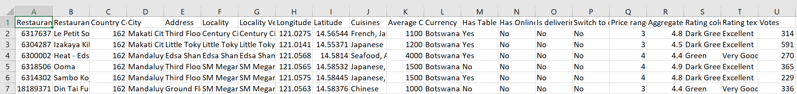

# SOEN-691-PROJECT BIG DATA ANALYTICS PROJECT

## Team Composition

| Name  | Student id | Email Ids |
| --- | --- | ---|
| 40087977 | Sai Krishna | saich94@gmail.com |
| 40083289 | Dhaval Modi | dhavalmodi556@gmail.com |
| 40082236 | Manushree Mallaraju | NA |

## Project Type
Dataset Analysis (Recommender System)

## Abstract
In the given dataset we have almost 10000 restaurants scattered across different metro cities. It is obviously difficult to find the best restaurant in the city. So for a user, who is new to the city, we want to build a recommender system which can give him/her options of various restaurants based on the different parameters. The parameters that we are going to consider are reviews given by others, similar restaurant to his/her personal preference and location. We will implement two recommender systems, which will be content based and colloberative filtering based.

## I. Introduction
### Context

There are many options available to a particular user. But it would be more helpful, if we could get personalized preferences. This user might review the restaurant. And adding his/her rating, we can improvise the recommedation for the next user. So, with each increased rating we can make our recommender system more efficient with increasing amount of data. That is exactly our goal, to make best use of the avalable dataset and to make the best matching restaurant to user's need.

### Objectives

* The main objective of this project is to recommend a restaurant to a user, based on ratings and number of votes using two most popular algorithms.
* The second objective is to evaluate the result obtained using Root mean squared error (RMSE) metric. And then comparing the evaluation results of these algorithms.

### Presentation of the problem to solve

* <b>Problem : </b> To find a recommedation of a restaurant based on the reviews/preference and location.

  <b>Solution: </b> First we will analyse the exisitng data, transform the data. And then we will recommend the restaurant to users based on Content Based recommnedation and ALS recommender. At the end, we will also compare the result of these two recommnder algorithms.

* <b>Problem : </b> Out of these two algorithms, which algorithm performs better.
 
  <b>Solution: </b> We will evaluate the each algorithms results using RMSE metric. Then we can compare these results to find out the best performing algorithm.

### Related work 

There are many data analysis papers on this datataset.  
* https://www.kaggle.com/parthsharma5795/finding-the-best-restaurants-in-bangalore  
* https://www.kaggle.com/chirag9073/zomato-restaurants-analysis-and-prediction  

But most of these work are limited to analysis of the data. We want to go one extra step ahead and want to implement ALS and Content based recommender system for the user base.

## II. Materials and Methods

### Dataset

This dataset is not officially provided by the Data Owner. It is collected using the web scrapper. It is publicly available on Keggle and uploader by the user who has colllected and updated the data over the period of time. 

The dataset has 10000 rows where each row represents the restaurant and it's attributes. Though it's unofficial dataset, the datset is  cleaned but definitely not ideal. This dataset has been collected over two phases. This may be the reason for the noise in the data.

This dataset has mainly underlying problems

* Scattered Data :  In the dataset we have many mtero cities. Apart from 3 metro cities all other cities have more or less almost equally number of restaurants. In other words we have many scattered clusters with each have almost same number of dataset.

&nbsp;   &nbsp;   &nbsp;   &nbsp;   &nbsp; 

* Imbalanced Data :  For 3 cities have most number of the restaurants, so it can have major effect on the result.

&nbsp;   &nbsp;   &nbsp;   &nbsp;   &nbsp; 

It has total 21 columns but we are not going to focus on all of them. The main columns we have considered are given below.

* <b>Restaurant Id :</b> Unique Id  
&nbsp;   &nbsp;   &nbsp; We have chosen this column to uniquly identify restaurant.
* <b>Restaurant Name :</b> contains the name of the restaurant  
&nbsp;   &nbsp;   &nbsp; We have chosen this column to print result along with restaurant names.
* <b>Cuisenes :</b> contains the variety of cusiens.  
&nbsp;   &nbsp;   &nbsp; We have chosen this column if the user want to filter based on cuisenes.
* <b>Aggregate rating :</b> Average rating of the restaurant  
&nbsp;   &nbsp;   &nbsp; We have chosen this column to use these rating for content based filtering.
* <b>Votes :</b> Number of votes given to particular restaurant  
&nbsp;   &nbsp;   &nbsp; We have chosen this column to put thresold for minimum nuber of votes.
* <b>Average Cost for two :</b> contains the approximate cost for meal for two people  
&nbsp;   &nbsp;   &nbsp; We have chosen this column if the user want to filter based on cost.

### Sample Data

### Technologies

We are going to use Python, Pandas and Matplotlib. We are going to use Python libraries for general computation on data. Pandas will be useful analysing data and also transforming the data at the same time. Using Matplotlib, we will be able to generate graphs for visulization of huge data.

### Algorithms

* <b>Content-based filtering :</b> In this algorithm, we will use item metadata, such as Locality, Cuisine, rating, etc. for restaurants, to make these recommendations. Here, we are solely relied on item data rather than other user's  metadata.

* <b>Alternating Least Squares (ALS) :</b>  Using this algorithm, we will try to predict the rating or preference that a user would give an item-based on past ratings and preferences of other users. In this technique, we will not use item metadata unlike content-based filtering algorithm.

### Metrics

* <b>Root mean squared error (RMSE) :</b> We will use this metric to measure of the differences between sample values and predicted by a recommender model.
